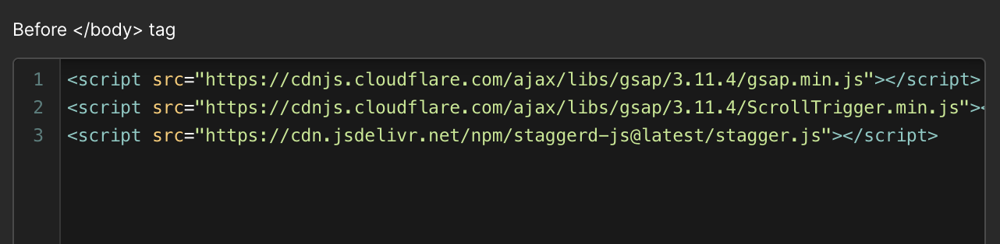
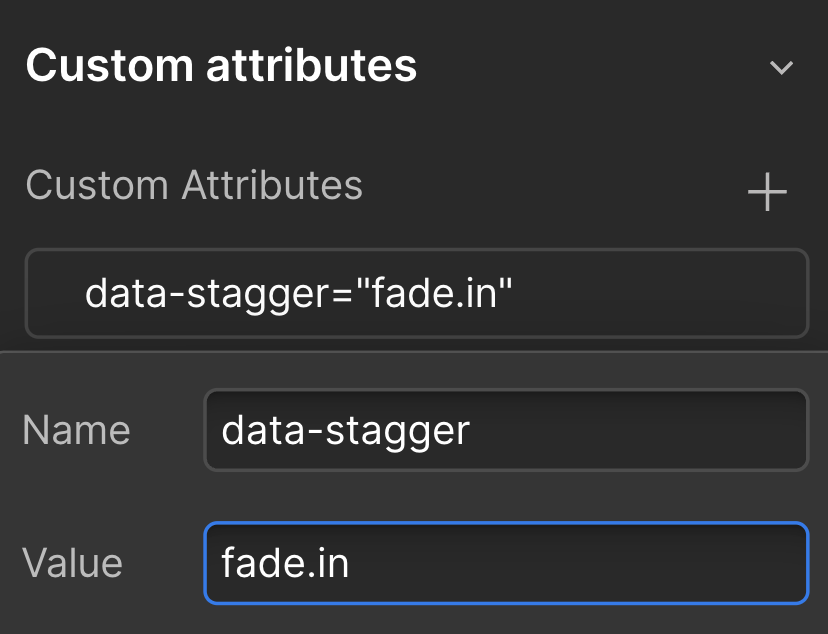

# Stagger Interactions for Webflow

## Why We Need This

Webflow's built-in interactions, while powerful, can lead to bloated webflow.js files. This bloat often results in slower load times and decreased overall site performance, potentially impacting user experience and search engine rankings. Our system provides a lightweight alternative that maintains rich animation capabilities while significantly improving load times and performance.

## One Magic Attribute (To Rule Them All)

We've condensed all animation controls into a single, powerful attribute: data-stagger. This attribute allows you to specify the animation type and direction in one concise instruction.

## How It Works

Add the data-stagger attribute to an element to animate it and its children. The attribute uses the following syntax:
`data-stagger=[animation-type].[direction]`

For example:
`data-stagger=fade.in` - Fades in the element and its children
`data-stagger=slide.left` - Slides the element and its children from the left

The script automatically handles the staggering of child elements, so you don't need to specify anything on the children individually.

## Implementation

Add GSAP ScrollTrigger and this script to your project by including this snippet before the closing `</body>` tag:

```html
<script src="https://cdnjs.cloudflare.com/ajax/libs/gsap/3.11.4/gsap.min.js"></script>
<script src="https://cdnjs.cloudflare.com/ajax/libs/gsap/3.11.4/ScrollTrigger.min.js"></script>
<script src="https://unpkg.com/webflow-stagger@latest/stagger.js"></script>
```



Start using the `data-stagger` attribute in your HTML elements.

## Preventing Flash of Unstyled Content (FOUC)

Flash of Unstyled Content (FOUC) occurs when elements appear briefly before animations start, creating a jarring visual effect. To prevent this, add the following CSS to your `<head>`:

```html
<style>
  [data-stagger] {
    visibility: hidden;
  }
</style>
```

This CSS hides elements with the data-stagger attribute initially. Our animation system then handles their visibility, ensuring smooth transitions from hidden to visible states as animations begin.

## Full List of Interaction Options

1. **Fade**

   - `fade.in`
   - `fade.left`
   - `fade.right`
   - `fade.top`
   - `fade.bottom`

2. **Slide**

   - `slide.left`
   - `slide.right`
   - `slide.top`
   - `slide.bottom`

3. **Zoom**

   - `zoom.in`
   - `zoom.out`

4. **Flip**

   - `flip.x`
   - `flip.y`

5. **Rotate**

   - `rotate.left`
   - `rotate.right`

6. **Bounce**

   - `bounce.in`
   - `bounce.left`
   - `bounce.right`

7. **Elastic**

   - `elastic.in`
   - `elastic.left`
   - `elastic.right`

8. **Blur**

   - `blur.in`

9. **Shake**

   - `shake.x`
   - `shake.y`

10. **Swing**

    - `swing.in`

11. **Spiral**

    - `spiral.left`
    - `spiral.right`

12. **Hinge**

    - `hinge.out`

13. **Pulsate**

    - `pulsate.in`

14. **Drop In**

    - `dropIn.top`

15. **Unfold**

    - `unfold.horizontal`
    - `unfold.vertical`

16. **Rise**

    - `rise.in`

17. **Typewriter**
    - `typewriter.in`

To use these, simply add the `data-stagger` attribute to a parent element with the desired animation type and direction. For example:

- `data-stagger=bounce.in`
- `data-stagger=slide.left`
- `data-stagger=zoom.in`



## Animation Details

Animations are triggered when the top of an element reaches 80% of the viewport height.

Child elements are automatically staggered with a 0.2-second delay between each.

Each animation has a default duration of 0.6 seconds.

If an unknown animation preset is used, the script will fall back to a default `fade.in` animation and log a warning to the console.

## Debug Mode

The library includes a debug mode to help with troubleshooting and development. To toggle debug mode:

Press the `d` key on your keyboard while on the page.
The page will reload with debug mode enabled/disabled.

When debug mode is active, the script will log additional information to the console, including:

- Number of elements found with data-stagger attributes
- When batch animations are triggered
- Details about each animated element

Debug mode state is stored in localStorage, so it will persist across page reloads until toggled off.

## Inspiration from Lumos

Our approach draws inspiration from Timothy Ricks' Lumos styling system. Lumos pioneered the concept of concatenating multiple style parameters into a single class, allowing for powerful and flexible styling options. We've adapted this idea to work with animations, using a single attribute to control multiple aspects of an animation.

## Who Made This

This system was developed by Michael Schwartz at Studio Gushon, a Webflow agency passionate about creating high-performance, visually appealing websites. We combined our expertise in Webflow, GSAP, and performance optimization to create this lightweight animation system.

## Want to Contribute?

We welcome contributions to improve and expand this system! If you have ideas for new animations, performance optimizations, or bug fixes, please visit our GitHub repository at [repository link]. You can submit issues, feature requests, or pull requests. Let's work together to make web animations faster and more accessible for everyone!
